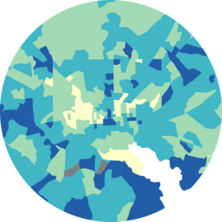

<!-- README.md is generated from README.Rmd. Please edit that file -->

```{r, include = FALSE}
knitr::opts_chunk$set(
  collapse = TRUE,
  comment = "#>",
  fig.path = "man/figures/README-",
  out.width = "100%"
)
```

# justviz <a href="https://umbc-viz.github.io/justviz/"></a>

<!-- badges: start -->
<!-- badges: end -->

This is a small package for resources for UMBC's GES 778, a graduate class on data visualization. It's an easy way to distribute datasets and a few utility functions for the class, and provides a space for students to contribute code.

## Installation

You can install the development version of justviz like so:

``` r
install.packages("devtools")
devtools::install_github("umbc-viz/justviz")
```

See the [course notes](https://umbc-viz.github.io/ges778/) for examples.
